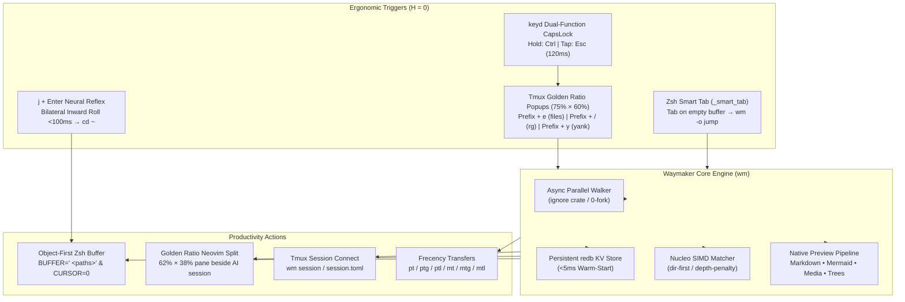

# Waymaker (`wm`)

<div align="center">

[](https://crates.io/crates/waymaker-cli)
[](https://github.com/fcmiranda/waymaker/releases)
[](https://github.com/fcmiranda/waymaker/blob/main/waymaker-cli/LICENSE)
[](https://github.com/fcmiranda/waymaker/releases)
[](https://www.rust-lang.org/)

**Next-generation terminal fuzzy finder, in-process file manager, media & markdown viewer, and tmux session orchestrator.**

[Features](#-features) • [Lineage & Inspirations](#-lineage--inspirations) • [Workflow Ecosystem](#-workflow-architecture--shell-ecosystem) • [Presets Suite](#-presets-suite) • [Installation](#-installation) • [Configuration](#-configuration) • [CLI & Subcommands](#-cli--subcommands) • [Library](#-rust-library)

</div>

---


## 🌟 Overview

**Waymaker (`wm`)** is a blazing-fast, keyboard-anchored, and infinitely composable TUI fuzzy searcher, file navigator, and workflow engine written in Rust. It takes terminal productivity beyond traditional fuzzy finders by unifying multi-column data filtering, in-process filesystem crawling, native media/markdown rendering, Tmux session management, and extensible TOML presets into a single sub-perceptual latency experience ($T_R < 10\text{ ms}$).

### 🧬 Lineage & Inspirations

Waymaker is an evolutionary, feature-rich **fork of [matchmaker](https://github.com/Squirreljetpack/matchmaker)** (`mm`), designed to expand its core matching capabilities into a comprehensive terminal control plane inspired by state-of-the-art terminal tools:

- 🎯 **[matchmaker](https://github.com/Squirreljetpack/matchmaker)**: The foundational DNA — Nucleo SIMD matching algorithm, hierarchical TOML partial-merge configuration, dynamic CLI overrides, multi-column tab splitting, and interactive preview layouts.
- 📺 **[television](https://github.com/alexpasmantier/television)**: Fast TUI engine architecture, preview channel pipelines, and multi-channel inspection — modern Rust design, sub-millisecond source switching, smart sorting thresholds, multi-threaded SIMD matching, and instant responsive previews.
- 🚀 **[zoxide](https://github.com/ajeetdsouza/zoxide)**: Advanced frecency algorithm (frequency + recency) and adaptive directory navigation — learning historical directory habits, intelligent query scoring, and keyboard-anchored muscle memory (`j` / `zi`). Waymaker builds upon zoxide's principles by embedding a persistent `redb` KV store in-process, unifying frecency ranking directly into interactive multi-column pickers and file manager overlays.
- 🖼️ **[mcat](https://github.com/Skardyy/mcat)**: State-of-the-art terminal Markdown and media inspection — native CommonMark/GFM rendering, syntax-highlighted code fences, inline Kitty Unicode Placeholders (`\u{10EEEE}`) for Mermaid diagrams, and modal zoomable diagram inspection with dynamic theme synchronization.
- ⚡ **[sesh](https://github.com/joshmedeski/sesh)**: First-class Tmux session orchestration — deterministic session derivation, `session.toml` and `sesh.toml` wildcard patterns, directory auto-detection, startup commands, and seamless session switching via `wm session` / `wm connect`.
- 🗂️ **[yazi](https://github.com/sxyazi/yazi)**: Asynchronous non-blocking architecture — zero-fork in-process parallel filesystem walker (`ignore`), off-thread media previews (`ratatui-image`), embedded file manager operations with `UndoStack` (`fm.rs`), and instant responsiveness.

---

## ✨ Features

### 🔍 Search & Filtering
- **Nucleo SIMD Fuzzy Matcher**: Multi-threaded, cache-conscious fuzzy filtering powered by [nucleo](https://github.com/helix-editor/nucleo) with path depth penalty (`depth_penalty = 15`), directory-first weighting, and typo tolerance.
- **Headless Filter Mode (`wm -f <query>`)**: Filter stdin streams or local directories instantly without initializing the TUI — perfect for ultra-fast shell scripts and Zsh ZLE widgets.
- **Multi-Column Filtering & Regex Captures**: Split tabular input with delimiters or regex capture groups; filter individually per column (`%col query`), hide helper columns, and colorize active fields.
- **Tri-Modal Data Source Cycling (`@reloadnext`)**: Seamlessly cycle between **Local Workspace** (native crawler), **Global Frecency** (`wm list --dirs`), and **Starred Bookmarks** (`wm list --bookmarks`) with a single keypress.

### ⚡ Performance & Systems Architecture
- **Native In-Process Parallel Walker**: Multi-threaded, git-aware directory tree scanner using Rust's `ignore` crate, completely eliminating `fork+exec` subprocess overhead.
- **Persistent Root Directory Cache**: Embedded [redb](https://github.com/cberner/redb) key-value store (`~/.local/state/waymaker/dir_cache.redb`) delivering **< 5ms instant warm-starts** on repeated invocations in large monorepos.
- **Zero-Friction Home Row Anchoring ($H = 0$)**: Complete keyboard navigation engineered for vim motions (`hjkl`), modal Nav mode, and dual-function CapsLock (`Esc` tap / `Ctrl` hold) without awkward `Alt/Option` chords.

### 🖼️ Rich Previews & Media Rendering
- **Native Terminal Media**: High-performance graphic rendering for Images (`.png`, `.jpg`, `.webp`, `.gif`), Videos (thumbnails via `ffmpegthumbnailer`), and PDFs (via `pdftoppm`) using Kitty graphics protocol, Sixel, and iTerm2 via `ratatui-image`.
- **In-Terminal Markdown & Mermaid Diagrams**: Built-in CommonMark parser with syntax-highlighted code fences, inline Mermaid diagram rasterization (`\u{10EEEE}`), and interactive modal viewer (`ToggleDiagram` / `s` / `Ctrl+S`) with zoom (`+`/`-`/`0`) and pan controls.
- **Native Directory Tree**: Instant colored directory tree view with file sizes, permissions, and Nerd Font icons (`wm tree`), eliminating the need for external `eza` or `tree` processes.
- **Dynamic Layout Engine**: Drag-to-resize dividers, sticky header lines, responsive horizontal/vertical splits, auto-scrolling line synchronization, and multiple layout toggles (`Ctrl+/`).

### 🗄️ Integrated File Manager & Actions
- **Embedded File Operations (`fm.rs`)**: In-place file creation (`a`), rename (`r`), trash (`d`), archive compression (`z`/`Z`), and clipboard yanking (`y`/`x`/`p`/`P`) with recursive drill-down (`l`) and parent ascension (`h`).
- **Transactional Undo Stack (`u`)**: Dedicated `@undo` action to safely reverse accidental file operations and restore clipboard states.
- **Ancestor Hierarchy Jump (`Ctrl+U`)**: Instantly jump up multi-level folder hierarchies directly to the repository or filesystem root.

---

## 🔬 Workflow Architecture & Shell Ecosystem

Waymaker is engineered as an ultra-low-latency control plane for keyboard-driven terminal environments. Here is how seamless, zero-friction workflows are orchestrated across Tmux, Zsh, and Neovim:



### 1. Biomechanical Ergonomics & Home Row Anchoring ($H = 0$)
- **Zero Hand Homing ($T_H = 0\text{ ms}$)**: Hands stay permanently anchored to the Home Row (`ASDF / JKL;`).
- **Kernel Modifiers (`keyd`)**: Dual-function `CapsLock` acts as `Ctrl` when held and `Esc` when tapped.
- **No `Alt/Option` Chords**: Eliminates thumb adduction and ulnar wrist deviation; all primary actions trigger via home-row taps, inward rolls (`CapsLock + J/K`, `CapsLock + Space`), or single-key navigation mode.
- **The Sacred `j + Enter` Reflex**: Bilateral inward roll (`j` with right index, `Enter` with right pinky) executes in $<100\text{ ms}$ to navigate straight to `$HOME` (`cd ~`).

### 2. Tmux Golden Ratio Popups ($\phi \approx 1.618$)
Modal pickers launch in centered Tmux popups sized to the Golden Ratio **$75\% \times 60\%$**, providing an optimal $2^\circ\text{–}5^\circ$ foveal viewing cone with an internal 40/60 candidate/preview division:
- `Prefix + e` / `Prefix + C-e`: **Workspace Files** (`wm -o workspace`) — browse files, markdown, and Mermaid diagrams.
- `Prefix + /`: **Live Ripgrep** (`wm -o rg`) — full-text search with line-synchronized preview.
- `Prefix + y` / `Prefix + C-y`: **Scrollback Extractor** (`wm -o yank`) — extrakto-style regex token and URL extractor.
- `Prefix + P`: **GitHub Pull Request Review** (`wm -o pr`) — interactive PR inspection and diff viewer.
- `Prefix + ?`: **Keybindings HUD** (`wm -o keybindings`) — searchable workflow cheat sheet.

### 3. Polymorphic Zsh ZLE & Smart Tab
- **Empty Buffer + `Tab`**: Instantly launches `_jump_widget` (`wm --no-read -o jump`) — jump anywhere without typing verbs (`cd`, `z`).
- **Ghost Text Suggestion + `Tab`**: Accepts the suggestion (`autosuggest-accept`).
- **Buffer with Text + `Tab`**: Invokes context-aware argument completion via `wm-ftb` (`wm -o ftb`).
- **Object-First Buffer Ergonomics**: Selecting a directory jumps immediately; selecting files formats their paths and injects them into the Zsh buffer with a leading space and `CURSOR = 0` (`BUFFER=" <paths>"`), allowing immediate typing of verbs (`nvim`, `bat`, `git add`).

### 4. High-Speed File Transfers & Frecency 2.0
- `pt [files]`: Interactive paste to a directory picked via `wm -o jump`.
- `ptg [files]`: Paste and immediately navigate (`cd`) to destination.
- `ptl [files]`: Paste directly to the **last selected target directory** (`_MM_LAST_TARGET`), bypassing the UI entirely ($T = 220\text{ ms}$).
- `mt`, `mtg`, `mtl`: Equivalent zero-friction move operations.

---

## 🧰 Presets Suite

Waymaker presets are modular, reusable TOML configurations stored in `~/.config/waymaker/presets/<name>.toml`, invoked cleanly via `wm -o <name>`:

| Preset | Invocation | Description | Key Ergonomic Actions |
| :--- | :--- | :--- | :--- |
| **`jump`** | `wm -o jump` | Flagship frecency directory navigator, file manager, and tree inspector. | `Enter`: `cd` to path<br>`e` / `Ctrl+E`: Open in Neovim<br>`l`: Drill into directory<br>`h`: Jump to parent<br>`u`: `@undo` file action<br>`Ctrl+U`: Ancestor hierarchy jump<br>`y` / `x` / `p`: Yank, Cut, Paste |
| **`workspace`** | `wm -o workspace` | Workspace file inspector for code, markdown, and Mermaid diagrams. | `Enter`: Toggle 60% / 100% fullscreen preview<br>`Tab`: Cycle sources (Local $\to$ Frecency $\to$ Bookmarks)<br>`s` / `Ctrl+S`: Modal diagram viewer<br>`Ctrl+V`: Insert path into origin pane<br>`e`: Open in Neovim |
| **`rg`** | `wm -o rg` | Live workspace full-text search with ripgrep and line-synced `bat` preview. | `Enter`: Open at line (`nvim +{line} {file}`)<br>`Ctrl+S`: Toggle Case Sensitivity (`[Aa]`)<br>`Ctrl+W`: Toggle Whole Word (`[W]`)<br>`Ctrl+/`: Cycle preview layouts |
| **`yank`** | `wm -o yank` | Extrakto-style regex token, path, URL, and git hash extractor from scrollback. | `Enter`: Copy to clipboard<br>`Ctrl+V`: Insert into origin pane<br>`Tab`: Cycle filter tabs (`all` $\to$ `cmd` $\to$ `path` $\to$ `url` $\to$ `sha`)<br>`b`: Open URL in browser |
| **`session-picker`** | `wm session` / `wm -o session-picker` | High-performance Tmux session switcher with live pane previews and icon badges. | `Enter`: Connect to session (`wm connect`)<br>`d`: Terminate session<br>`Tab`: Filter active vs configured sessions |
| **`ftb`** | `wm -o ftb` | Tab completion backend for Zsh `fzf-tab` with multi-column Nucleo fuzzy matching. | `Tab`: Select item<br>`Shift-Tab`: Previous<br>`Ctrl+P`: Toggle preview |
| **`kill`** | `wm -o kill` | Interactive TCP listening port and process terminator with live connection telemetry. | `Enter`: Send `SIGTERM` (15)<br>`Ctrl+X`: Force `SIGKILL` (-9) |
| **`keybindings`** | `wm -o keybindings` | Interactive workflow HUD and shortcut cheat sheet across Tmux, Zsh, Hyprland, and Neovim. | `Enter`: Execute workflow<br>`Tab`: Cycle categories<br>`y`: Copy keybinding |
| **`wt`** | `wm -o wt` | Interactive Git worktree switcher integrated with worktrunk and status preview. | `Enter`: Checkout worktree |
| **`memory`** | `wm -o memory` | AI agent memory, instructions, skills, and rules explorer. | `Enter`: Open file in editor |
| **`pr`** | `wm -o pr` | GitHub Pull Request review modal with diff inspection. | `Enter`: Open PR in browser<br>`d`: View full diff |
| **`borders`** | `wm -o borders` | Live Hyprland window border gradient switcher. | `j` / `k`: Live preview on window<br>`Enter`: Persist style |
| **`animations`** | `wm -o animations` | Live Hyprland window animation curve switcher. | `j` / `k`: Live preview curve<br>`Enter`: Persist animation |

---

## 📦 Installation

Waymaker includes an all-in-one installation script that installs the binary **and automatically deploys all `.toml` configuration files and presets to the correct system directories**.

### 1-Line Universal Installer (Binary + Configs + Presets)

```sh
curl -fsSL https://raw.githubusercontent.com/fcmiranda/waymaker/main/install.sh | sh
```

### From Local Source (Repository Clone)

Clone the repository and run `install.sh`:

```sh
git clone https://github.com/fcmiranda/waymaker.git
cd waymaker

# Build release binary and deploy all .toml configs and presets
./install.sh
```

Or using `just`:

```sh
# Builds release workspace and installs binary to ~/.local/bin/wm
just install

# Deploy .toml configurations and presets
./install.sh --configs-only
```

### Installer CLI Options

The `install.sh` script provides dedicated options for managing binaries and configuration files:

```sh
# Deploy or update .toml configs and presets only (leaves binary untouched)
./install.sh --configs-only

# Install or update the 'wm' binary only
./install.sh --binary-only

# Overwrite existing configs without generating timestamped .bak backups
./install.sh --force

# View installer help
./install.sh --help
```

### Destination Layout

The installer deploys configuration assets directly into standard XDG locations:

```
~/.local/bin/
└── wm                              # Executable binary

~/.config/waymaker/
├── config.toml                     # Master configuration file
├── session.toml                    # Session & wildcard orchestration config
└── presets/                        # Specialized workflow presets
    ├── jump.toml                   # Frecency directory navigator
    ├── workspace.toml              # Workspace file & diagram inspector
    ├── rg.toml                     # Live ripgrep searcher
    ├── yank.toml                   # Tmux scrollback token extractor
    ├── session-picker.toml         # Tmux session manager
    ├── ftb.toml                    # Zsh tab completion backend
    ├── kill.toml                   # Process & port terminator
    ├── keybindings.toml            # Interactive workflow HUD
    └── ...                         # Domain-specific presets
```

---

## ⚙️ Configuration

Waymaker configuration files are strictly type-checked TOML files.

### Base Configuration (`config.toml`)

Dump the active default configuration at any time:

```sh
wm --dump-config
```

Example `~/.config/waymaker/config.toml`:

```toml
[tui]
percentage = 60
min = 10
max = 120

[ui]
border = { type = "Rounded" }

[preview]
show = true
wrap = true
markdown = true                     # Native CommonMark & syntax highlighting
media = true                        # Native Kitty / Sixel image & video previews
diagrams = true                     # Native Mermaid diagram rasterization
inline_diagrams = true              # Kitty Unicode Placeholders (\u{10EEEE})
diagram_theme = "auto"              # Auto-sync with terminal dark/light palette
diagram_background = "transparent"  # Borderless diagram flow

[[preview.layout]]
side = "right"
percentage = 60
min = 30

[matcher]
sort = "smart"                      # Natural order on empty query, fuzzy sort on typing
depth_penalty = 15                  # SIMD-accelerated root file priority
dir_first = true                    # Prioritize directories in file pickers
```

### Session Configuration (`session.toml`)

Compatible with both Waymaker and Sesh session definitions (`~/.config/waymaker/session.toml` or `~/.config/sesh/sesh.toml`):

```toml
# Wildcard auto-session definitions
[[wildcard]]
pattern = "~/dev/github/**"
startup_command = "nvim"

[[wildcard]]
pattern = "~/projects/**"
startup_command = "nvim"

# Explicit pinned sessions
[[session]]
name = " Downloads"
path = "~/Downloads"
startup_command = "wm -o jump"
```

### Dynamic CLI Overrides

Waymaker features a compact, expressive override syntax allowing on-the-fly customization:

```sh
# Override preview command, layout percentage, and remove single quotes
wm p.l "cmd=echo {}|||p=50|||max=20" cmd "ls" o "{=}"

# Start directly in Nav mode with plain borders
wm ui.nav_mode=true ui.border.type=Plain
```

---

## 💻 CLI & Subcommands

Waymaker includes specialized standalone subcommands for high-speed terminal inspection without shell overhead:

```sh
# 1. Fuzzy Picker & Presets
wm                              # Interactive search on current directory
find . | wm                     # Filter piped input
wm -o jump                      # Launch jump preset
wm -o workspace                 # Launch workspace preset

# 2. Headless Filtering (no TUI)
wm -f "search_term"             # Headless directory filter to stdout
echo -e "apple\nbanana" | wm -f "ban" # Headless stdin stream filter

# 3. Session Management (sesh compatible)
wm session                      # Interactive Tmux session picker
wm session list --icons         # List active and configured sessions
wm connect <session-name>       # Connect or attach to session
wm last                         # Switch to previous Tmux session

# 4. In-Terminal Markdown & Mermaid Viewer
wm md README.md                 # Render markdown with syntax highlighting & diagrams
wm md README.md --watch         # Live auto-reloading markdown preview
wm mermaid diagram.mmd          # Render standalone Mermaid diagram in terminal

# 5. Native Directory Tree
wm tree .                       # Render colored git-aware directory tree

# 6. Frecency Management
wm add ~/dev/project            # Asynchronously record directory visit
wm list --dirs                  # Output ranked frecency directory list
wm list --bookmarks             # Output starred bookmarks
```

---

## 📚 Rust Library

Waymaker can be embedded directly into your Rust applications as an ultra-fast picker engine:

```toml
[dependencies]
waymaker = "0.1"
tokio = { version = "1", features = ["full"] }
```

```rust
use waymaker::nucleo::{Indexed, Worker};
use waymaker::{MatchError, Result, Selector, Waymaker};

#[tokio::main]
async fn main() -> Result<()> {
    let items = vec!["alpha", "beta", "gamma", "delta"];

    let worker = Worker::new_single_column();
    worker.append(items);
    let selector = Selector::new(Indexed::identifier);
    let wm = Waymaker::new(worker, selector);

    match wm.pick_default().await {
        Ok(selected) => println!("Selected: {}", selected[0]),
        Err(MatchError::Abort(_)) => eprintln!("Cancelled"),
        Err(err) => eprintln!("Error: {err}"),
    }

    Ok(())
}
```

See [ARCHITECTURE.md](waymaker-lib/ARCHITECTURE.md) for core event flow and internals.

---

## 🤝 Acknowledgements

Waymaker stands on the shoulders of remarkable terminal software:

- **[matchmaker](https://github.com/Squirreljetpack/matchmaker)** by Squirreljetpack — the upstream foundation.
- **[television](https://github.com/alexpasmantier/television)** by Alex Pasmantier — inspiring modern Rust TUI engine design and multi-channel previewing.
- **[zoxide](https://github.com/ajeetdsouza/zoxide)** by Ajeet D'Souza — the gold standard for smart directory frecency jumping.
- **[mcat](https://github.com/Skardyy/mcat)** by Skardyy — inspiring in-terminal Markdown and Mermaid rendering.
- **[sesh](https://github.com/joshmedeski/sesh)** by Josh Medeski — defining modern Tmux session workflow ergonomics.
- **[yazi](https://github.com/sxyazi/yazi)** by sxyazi — pioneering async, non-blocking terminal file management.
- **[fzf](https://github.com/junegunn/fzf)** by Junegunn Choi — setting the standard for command-line fuzzy finding.
- **[nucleo](https://github.com/helix-editor/nucleo)** by Helix Editor — low-latency SIMD matcher engine.
- **[ratatui](https://github.com/ratatui/ratatui)** — modern Rust terminal user interface library.

---

## 📄 License

Waymaker is open-source software licensed under the **GNU Affero General Public License v3.0 (AGPL-3.0)**. See the [LICENSE](waymaker-cli/LICENSE) file for details.
